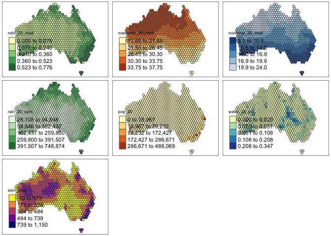

Geog6300: Lab 6
================

## Regression

``` r
library(sf)
library(tidyverse)
```

**Overview:** This lab focuses on regression techniques. You’ll be
analyzing the association of various physical and climatological
characteristics in Australia with observations of several animals
recorded on the citizen science app iNaturalist.

\###Data and research questions###

Let’s import the dataset.

``` r
lab6_data<-st_read("data/aus_climate_inat.gpkg")
```

    ## Reading layer `aus_climate_inat' from data source 
    ##   `/Users/liam/Library/CloudStorage/OneDrive-UniversityofGeorgia/GEOG 4300/labs/lab-6/data/aus_climate_inat.gpkg' 
    ##   using driver `GPKG'
    ## Simple feature collection with 716 features and 22 fields
    ## Geometry type: POLYGON
    ## Dimension:     XY
    ## Bounding box:  xmin: 113.875 ymin: -43.38632 xmax: 153.375 ymax: -11.92074
    ## Geodetic CRS:  WGS 84 (CRS84)

The dataset for this lab is a 1 decimal degree hexagon grid that has
aggregate statistics for a number of variables:

- ndvi: NDVI/vegetation index values from Landsat data (via Google Earth
  Engine). These values range from -1 to 1, with higher values
  indicating more vegetation.
- maxtemp_00/20_med: Median maximum temperature (C) in 2000 or 2020
  (data from SILO/Queensland government)
- mintemp_00/20_med: Median minimum temperature (C) in 2020 or 2020
  (data from SILO/Queensland government)
- rain_00/20_sum: Total rainfall (mm) in 2000 or 2020 (data from
  SILO/Queensland government)
- pop_00/20: Total population in 2000 or 2020 (data from NASA’s Gridded
  Population of the World)
- water_00/20_pct: Percentage of land covered by water at some point
  during the year in 2000 or 2020
- elev_med: Median elevation (meters) (data from the Shuttle Radar
  Topography Mission/NASA)

There are also observation counts from iNaturalist for several
distinctively Australian animal species: the central bearded dragon, the
common emu, the red kangaroo, the agile wallaby, the laughing
kookaburra, the wombat, the koala, and the platypus.

Our primary research question is how the climatological/physical
variables in our dataset are predictive of the NDVI value. We will build
models for 2020 as well as the change from 2000 to 2020. The second is
referred to as a “first difference” model and can sometimes be more
useful for identifying causal mechanisms.

\###Part 1: Analysis of 2020 data###

We will start by looking at data for 2020.

**Question 1** *Create histograms for NDVI, max temp., min temp., rain,
and population, and water in 2020 as well as elevation. Based on these
graphs, assess the normality of these variables.*

``` r
ggplot(lab6_data, aes(x=ndvi_20_med)) +
  geom_histogram() 
```

    ## `stat_bin()` using `bins = 30`. Pick better value with `binwidth`.

<!-- -->

``` r
ggplot(lab6_data, aes(x=maxtemp_20_med)) +
  geom_histogram() 
```

    ## `stat_bin()` using `bins = 30`. Pick better value with `binwidth`.

<!-- -->

``` r
ggplot(lab6_data, aes(x=mintemp_20_med)) +
  geom_histogram() 
```

    ## `stat_bin()` using `bins = 30`. Pick better value with `binwidth`.

<!-- -->

``` r
ggplot(lab6_data, aes(x=rain_20_sum)) +
  geom_histogram() 
```

    ## `stat_bin()` using `bins = 30`. Pick better value with `binwidth`.

<!-- -->

``` r
ggplot(lab6_data, aes(x=pop_20)) +
  geom_histogram() 
```

    ## `stat_bin()` using `bins = 30`. Pick better value with `binwidth`.

<!-- -->

``` r
ggplot(lab6_data, aes(x=water_20_pct)) +
  geom_histogram() 
```

    ## `stat_bin()` using `bins = 30`. Pick better value with `binwidth`.

<!-- -->

``` r
ggplot(lab6_data, aes(x=elev_med)) +
  geom_histogram() 
```

    ## `stat_bin()` using `bins = 30`. Pick better value with `binwidth`.

<!-- -->

ndvi_20_med does not appear to be normally distributed. The histogram
does not resemble a bell curve and the data is right skewed.

maxtemp_20_med does not appear to be normally distributed. The histogram
does not resemble a bell curve and the data is left skewed.

mintemp_20_med does not appear to be normally distributed. The histogram
does not resemble a bell curve and the data is left skewed.

rain_20_sum does not appear to be normally distributed. The histogram
does not resemble a bell curve and the data is right skewed.

pop_20 does not appear to be normally distributed. The histogram does
not resemble a bell curve and the data is right skewed.

water_20_pct does not appear to be normally distributed. The histogram
does not resemble a bell curve and the data is right skewed.

elev_med does not appear to be normally distributed. The histogram does
not resemble a bell curve and the data is right skewed.

**Question 2** *Use tmap to map these same variables using Jenks natural
breaks as the classification method. For an extra challenge, use
`tmap_arrange` to plot all maps in a single figure.*

``` r
library(tmap)
```

    ## Breaking News: tmap 3.x is retiring. Please test v4, e.g. with
    ## remotes::install_github('r-tmap/tmap')

``` r
#tm_shape(lab6_data) +
#  tm_polygons("ndvi_20_med")


map_ndvi <- qtm(lab6_data, fill="ndvi_20_med", polygons.style = "jenks", polygons.palette ="YlGn", layout.legend.position = c("left", "bottom"), layout.legend.title.size=0.65, layout.legend.width = 1)
map_maxtemp <- qtm(lab6_data, fill="maxtemp_20_med", polygons.style = "jenks", layout.legend.position = c("left", "bottom"), layout.legend.title.size=0.65, layout.legend.width = 1)
map_mintemp <- qtm(lab6_data, fill="mintemp_20_med", polygons.style = "jenks", polygons.palette = "-Blues", layout.legend.position = c("left", "bottom"), layout.legend.title.size=0.65, layout.legend.width = 1)
map_rain <- qtm(lab6_data, fill="rain_20_sum", polygons.style = "jenks", polygons.palette = "Greens", layout.legend.position = c("left", "bottom"), layout.legend.title.size=0.65, layout.legend.width = 1)
map_pop <- qtm(lab6_data, fill="pop_20", polygons.style = "jenks", layout.legend.position = c("left", "bottom"), layout.legend.title.size=0.65, layout.legend.width = 1)
map_water <- qtm(lab6_data, fill="water_20_pct", polygons.style = "jenks", polygons.palette = "YlGnBu", layout.legend.position = c("left", "bottom"), layout.legend.title.size=0.65, layout.legend.width = 1)
map_elevation <- qtm(lab6_data, fill="elev_med", polygons.style = "jenks", polygons.palette = "-plasma", layout.legend.position = c("left", "bottom"), layout.legend.title.size=0.65, layout.legend.width = 1)

tmap_arrange(map_ndvi, map_maxtemp, map_mintemp, map_rain, map_pop, map_water, map_elevation)
```

<!-- -->

**Question 3** *Based on the maps from question 3, summarise major
patterns you see in the spatial distribution of these data from any of
your variables of interest. How do they appear to be associated with the
NDVI variable?*

The biggest “hotspot” of high NDVI is in Southeast Australia close to
the coast. This area has lower median minimum temperatures, more rain,
and areas of higher population than most other areas of the country.
Southeast Australia also has the highest median elevation of any area in
the country. This appears to suggest an association between NDVI and
these variables: the more cold, rainy, populous, and elevated an area
is, the higher its NDVI/vegetation index is.

**Question 4** *Create univariate models for each of the variables
listed in question 1, with NDVI in 2020 as the dependent variable. Print
a summary of each model. Write a summary of those results that indicates
the direction, magnitude, and significance for each model coefficient.*

``` r
model_maxtemp<-lm(ndvi_20_med~maxtemp_20_med, data=lab6_data)
model_mintemp<-lm(ndvi_20_med~mintemp_20_med, data=lab6_data)
model_rain<-lm(ndvi_20_med~rain_20_sum, data=lab6_data)
model_pop<-lm(ndvi_20_med~pop_20, data=lab6_data)
model_water<-lm(ndvi_20_med~water_20_pct, data=lab6_data)
model_elev<-lm(ndvi_20_med~elev_med, data=lab6_data)

summary(model_maxtemp)
```

    ## 
    ## Call:
    ## lm(formula = ndvi_20_med ~ maxtemp_20_med, data = lab6_data)
    ## 
    ## Residuals:
    ##      Min       1Q   Median       3Q      Max 
    ## -0.41874 -0.07657 -0.01927  0.06833  0.36382 
    ## 
    ## Coefficients:
    ##                  Estimate Std. Error t value Pr(>|t|)    
    ## (Intercept)     0.6612389  0.0294372   22.46   <2e-16 ***
    ## maxtemp_20_med -0.0130902  0.0009601  -13.63   <2e-16 ***
    ## ---
    ## Signif. codes:  0 '***' 0.001 '**' 0.01 '*' 0.05 '.' 0.1 ' ' 1
    ## 
    ## Residual standard error: 0.1251 on 714 degrees of freedom
    ## Multiple R-squared:  0.2066, Adjusted R-squared:  0.2055 
    ## F-statistic: 185.9 on 1 and 714 DF,  p-value: < 2.2e-16

``` r
summary(model_mintemp)
```

    ## 
    ## Call:
    ## lm(formula = ndvi_20_med ~ mintemp_20_med, data = lab6_data)
    ## 
    ## Residuals:
    ##      Min       1Q   Median       3Q      Max 
    ## -0.36375 -0.08418 -0.03047  0.06972  0.40383 
    ## 
    ## Coefficients:
    ##                 Estimate Std. Error t value Pr(>|t|)    
    ## (Intercept)     0.464461   0.018997   24.45   <2e-16 ***
    ## mintemp_20_med -0.012282   0.001131  -10.86   <2e-16 ***
    ## ---
    ## Signif. codes:  0 '***' 0.001 '**' 0.01 '*' 0.05 '.' 0.1 ' ' 1
    ## 
    ## Residual standard error: 0.1301 on 714 degrees of freedom
    ## Multiple R-squared:  0.1418, Adjusted R-squared:  0.1406 
    ## F-statistic:   118 on 1 and 714 DF,  p-value: < 2.2e-16

``` r
summary(model_rain)
```

    ## 
    ## Call:
    ## lm(formula = ndvi_20_med ~ rain_20_sum, data = lab6_data)
    ## 
    ## Residuals:
    ##      Min       1Q   Median       3Q      Max 
    ## -0.56681 -0.04753 -0.01210  0.04599  0.30930 
    ## 
    ## Coefficients:
    ##              Estimate Std. Error t value Pr(>|t|)    
    ## (Intercept) 1.303e-01  7.060e-03   18.45   <2e-16 ***
    ## rain_20_sum 9.124e-07  3.953e-08   23.08   <2e-16 ***
    ## ---
    ## Signif. codes:  0 '***' 0.001 '**' 0.01 '*' 0.05 '.' 0.1 ' ' 1
    ## 
    ## Residual standard error: 0.1063 on 714 degrees of freedom
    ## Multiple R-squared:  0.4273, Adjusted R-squared:  0.4265 
    ## F-statistic: 532.6 on 1 and 714 DF,  p-value: < 2.2e-16

``` r
summary(model_pop)
```

    ## 
    ## Call:
    ## lm(formula = ndvi_20_med ~ pop_20, data = lab6_data)
    ## 
    ## Residuals:
    ##      Min       1Q   Median       3Q      Max 
    ## -0.47003 -0.07883 -0.03949  0.06384  0.48974 
    ## 
    ## Coefficients:
    ##              Estimate Std. Error t value Pr(>|t|)    
    ## (Intercept) 2.552e-01  5.013e-03  50.902   <2e-16 ***
    ## pop_20      1.500e-06  1.500e-07   9.998   <2e-16 ***
    ## ---
    ## Signif. codes:  0 '***' 0.001 '**' 0.01 '*' 0.05 '.' 0.1 ' ' 1
    ## 
    ## Residual standard error: 0.1316 on 714 degrees of freedom
    ## Multiple R-squared:  0.1228, Adjusted R-squared:  0.1216 
    ## F-statistic: 99.97 on 1 and 714 DF,  p-value: < 2.2e-16

``` r
summary(model_water)
```

    ## 
    ## Call:
    ## lm(formula = ndvi_20_med ~ water_20_pct, data = lab6_data)
    ## 
    ## Residuals:
    ##      Min       1Q   Median       3Q      Max 
    ## -0.26898 -0.08838 -0.04838  0.06871  0.50911 
    ## 
    ## Coefficients:
    ##               Estimate Std. Error t value Pr(>|t|)    
    ## (Intercept)   0.268988   0.006287  42.781   <2e-16 ***
    ## water_20_pct -0.178263   0.154480  -1.154    0.249    
    ## ---
    ## Signif. codes:  0 '***' 0.001 '**' 0.01 '*' 0.05 '.' 0.1 ' ' 1
    ## 
    ## Residual standard error: 0.1403 on 714 degrees of freedom
    ## Multiple R-squared:  0.001862,   Adjusted R-squared:  0.0004636 
    ## F-statistic: 1.332 on 1 and 714 DF,  p-value: 0.2489

``` r
summary(model_elev)
```

    ## 
    ## Call:
    ## lm(formula = ndvi_20_med ~ elev_med, data = lab6_data)
    ## 
    ## Residuals:
    ##      Min       1Q   Median       3Q      Max 
    ## -0.27082 -0.09585 -0.04270  0.07954  0.44272 
    ## 
    ## Coefficients:
    ##              Estimate Std. Error t value Pr(>|t|)    
    ## (Intercept) 2.138e-01  9.741e-03  21.952  < 2e-16 ***
    ## elev_med    1.787e-04  2.895e-05   6.171 1.14e-09 ***
    ## ---
    ## Signif. codes:  0 '***' 0.001 '**' 0.01 '*' 0.05 '.' 0.1 ' ' 1
    ## 
    ## Residual standard error: 0.1369 on 714 degrees of freedom
    ## Multiple R-squared:  0.05064,    Adjusted R-squared:  0.04931 
    ## F-statistic: 38.08 on 1 and 714 DF,  p-value: 1.136e-09

NDVI and max temp have a statistically significant relationship. For
every 1-degree increase in median max temp, the NDVI decreases by
0.0130902. The R-squared is 0.20 suggesting that only a small amount of
variance (20%) in NDVI is explained by median max temp.

NDVI and min temp have a statistically significant relationship. For
every 1-degree increase in median min temp, the NDVI decreases by
0.012282. The R-squared is only 0.14 suggesting that only a small amount
of variance (14%) in NDVI is explained by median max temp.

NDVI and rainfall have a statistically significant relationship. For
every 1mm increase in rainfall, the NDVI increases by approx. one-one
millionth. The R-squared is 0.42 suggesting that a substantial amount of
variance (42%) in NDVI is explained by the amount of rainfall.

NDVI and population have a statistically significant relationship. For
every 1 person increase to the population, the NDVI increases by 1.500
\* 10^(-6). The R-squared is 0.12 suggesting that only a a small amount
of variance (12%) in NDVI is explained by population.

NDVI and water cover do not have a statistically significant
relationship. The p-value is 0.249 which is much greater than 0.05.

NDVI and elevation have a statistically significant relationship. For
every 1 meter increase in median elevation, the NDVI increases by 1.787
\* 10^(-4). The R-squared is 0.05 suggesting that practically none of
the variance (5%) in NDVI is explained by elevation.

**Question 5** *Create a multivariate regression model with the
variables of interest, choosing EITHER max or min temperature (but not
both) You may also choose to leave out any variables that were
insignificant in Q4. Use the univariate models as your guide. Call the
results.*

``` r
model_multivariate<-lm(ndvi_20_med~mintemp_20_med+rain_20_sum+pop_20+elev_med, data=lab6_data)

summary(model_multivariate)
```

    ## 
    ## Call:
    ## lm(formula = ndvi_20_med ~ mintemp_20_med + rain_20_sum + pop_20 + 
    ##     elev_med, data = lab6_data)
    ## 
    ## Residuals:
    ##      Min       1Q   Median       3Q      Max 
    ## -0.49488 -0.02773  0.00412  0.03928  0.25115 
    ## 
    ## Coefficients:
    ##                  Estimate Std. Error t value Pr(>|t|)    
    ## (Intercept)     3.208e-01  1.413e-02  22.707  < 2e-16 ***
    ## mintemp_20_med -1.391e-02  7.675e-04 -18.121  < 2e-16 ***
    ## rain_20_sum     9.420e-07  3.276e-08  28.756  < 2e-16 ***
    ## pop_20          2.424e-07  1.032e-07   2.349   0.0191 *  
    ## elev_med        1.028e-04  1.774e-05   5.797 1.02e-08 ***
    ## ---
    ## Signif. codes:  0 '***' 0.001 '**' 0.01 '*' 0.05 '.' 0.1 ' ' 1
    ## 
    ## Residual standard error: 0.0832 on 711 degrees of freedom
    ## Multiple R-squared:  0.6507, Adjusted R-squared:  0.6487 
    ## F-statistic: 331.1 on 4 and 711 DF,  p-value: < 2.2e-16

**Question 6** *Summarize the results of the multivariate model. What
are the direction, magnitude, and significance of each coefficient? How
did it change from the univariate models you created in Q4 (if at all)?
What do the R2 and F-statistic values tell you about overall model fit?*

The coefficient of mintemp_20_med is -1.391e-02. For every one degree
increase in min temp, NDVI decreases by 0.01391. This result is similar
to that of the univariate model. Min temp and NDVI have a highly
statistically significant relationship with an extremely small p value.

The coefficient of rain_20_sum is 9.420e-07. For each mm increase in
rainfall, NDVI increases by 9.420e-07. This result is similar to that of
the univariate model. Rainfall amount and NDVI have a highly
statistically significant relationship with an extremely small p value.

The coefficient of pop_20 is 2.424e-07. For every 1 person increase in
population, NDVI increases by 2.424e-07. The regression coefficient from
the univariate model is still extremely small but is about 6 times
larger than the population variable’s regression coefficient in the
multivariate model. Population and NDVI have a statistically significant
relationship with a p value of 0.02.

The coefficient of elev_med is 1.028e-04. For every one meter increase
in median elevation, NDVI increases by 1.028e-04. This result is similar
to that of the univariate model. Median elevation and NDVI have a highly
statistically significant relationship with an extremely small p value.

**Question 7** *Use a histogram and a map to assess the normality of
residuals and any spatial autocorrelation. Summarise any notable
patterns that you see.*

``` r
library(spdep)
```

    ## Loading required package: spData

    ## To access larger datasets in this package, install the spDataLarge
    ## package with: `install.packages('spDataLarge',
    ## repos='https://nowosad.github.io/drat/', type='source')`

``` r
lab6_data$residuals <- residuals(model_multivariate)
hist(lab6_data$residuals)
```

<!-- -->

``` r
shapiro.test(lab6_data$residuals)
```

    ## 
    ##  Shapiro-Wilk normality test
    ## 
    ## data:  lab6_data$residuals
    ## W = 0.82548, p-value < 2.2e-16

``` r
#ggplot(lab6_data,aes(sample=residuals))+
#  stat_qq()+stat_qq_line()

australia_grid_nb <- poly2nb(lab6_data, queen=TRUE)
```

    ## Warning in poly2nb(lab6_data, queen = TRUE): neighbour object has 2 sub-graphs;
    ## if this sub-graph count seems unexpected, try increasing the snap argument.

``` r
grid_weight <- nb2listw(australia_grid_nb,style="W",zero.policy=TRUE)

moran.test(lab6_data$ndvi_20_med,grid_weight)
```

    ## 
    ##  Moran I test under randomisation
    ## 
    ## data:  lab6_data$ndvi_20_med  
    ## weights: grid_weight    
    ## 
    ## Moran I statistic standard deviate = 31.683, p-value < 2.2e-16
    ## alternative hypothesis: greater
    ## sample estimates:
    ## Moran I statistic       Expectation          Variance 
    ##      0.7153118674     -0.0013986014      0.0005117187

``` r
moran.mc(lab6_data$ndvi_20_med,grid_weight,nsim=499)
```

    ## 
    ##  Monte-Carlo simulation of Moran I
    ## 
    ## data:  lab6_data$ndvi_20_med 
    ## weights: grid_weight  
    ## number of simulations + 1: 500 
    ## 
    ## statistic = 0.71531, observed rank = 500, p-value = 0.002
    ## alternative hypothesis: greater

``` r
local_g<-localG(lab6_data$ndvi_20_med,grid_weight)
  
lab6_data$localG<-local_g

lab6_data <- lab6_data %>%
  mutate(localG_recode=case_when(localG <= -1.96~"Cold",
                                 localG < 1.96~"No value",
                                 localG >= 1.96~"Hot"))

tm_shape(lab6_data) +
  tm_polygons(
    "localG_recode",
    palette = c("Cold" = "blue", "Hot" = "red", "No value" = "grey"),
    title = "NDVI hot/cold spots"
  )
```

<!-- -->

The histogram of the residuals is asymmetrical with more residuals
falling between -1 and -0.2 than between 0.2 and 1 (the largest positive
residual is only 0.25), so the residuals are not normally distributed. I
double-checked with the Shapiro-Wilk test which resulted in an extremely
small p-value, so we reject that test’s null hypothesis that the data
are normally distributed. The Moran I statistic for NDVI is 0.715. 0
indicates no autocorrelation and 1 means perfect clustering of similar
values. The I statistic of 0.715 means there is strong positive spatial
autocorrelation and that areas with similar NDVI values (high or low)
are spatially clustered together. As shown on the map, in eastern
Australia there is a large “hotspot” where areas with high NDVI are
clustered together. There is a cluster of low NDVI values in central
southern Australia (“coldspot”).

**Question 8** *Assess any issues with multicollinearity or
heteroskedastity in this model using the techniques shown in class. Run
the appropriate tests and explain what their results show you.*

``` r
library(car)
```

    ## Loading required package: carData

    ## 
    ## Attaching package: 'car'

    ## The following object is masked from 'package:dplyr':
    ## 
    ##     recode

    ## The following object is masked from 'package:purrr':
    ## 
    ##     some

``` r
library(lmtest)
```

    ## Loading required package: zoo

    ## 
    ## Attaching package: 'zoo'

    ## The following objects are masked from 'package:base':
    ## 
    ##     as.Date, as.Date.numeric

``` r
vif(model_multivariate)
```

    ## mintemp_20_med    rain_20_sum         pop_20       elev_med 
    ##       1.127167       1.121045       1.183240       1.015657

``` r
bptest(model_multivariate)
```

    ## 
    ##  studentized Breusch-Pagan test
    ## 
    ## data:  model_multivariate
    ## BP = 120.07, df = 4, p-value < 2.2e-16

I checked for multicollinearity using the VIF test. A value of 5 or more
indicates severe levels of multicollinearity that can cause problems in
a multivariate regression model. For each independent variable that is
part of the model I created in question 5, VIF was calculated as around
1 which is a low value indicating negligible variance inflation from
multicollinearity.

To test for heteroskedastity I used the Breusch-Pagan test. The null
hypothesis is that the residuals are distributed with equal variance and
that the data are not heteroskedastic. The p-value is extremely small
(p\<2.2e-16) so we reject the null hypothesis and conclude that there is
heteroskedasticity present in the model. Heteroskedasticity means that
the variance of the residuals is not constant across observations. This
could indicate that my model is missing key variables that explain
changes in NDVI, as the variability in NDVI is changing due to some
unaccounted factor or factors. To try to solve this issue, I could look
for more relevant variables and redefine my model to ensure all known
variables that influence NDVI are included in the multivariate
regression model.

**Question 9** *How would you summarise the results of this model in a
sentence or two? In addition, looking at the full model and your
diagnostics, do you feel this is a model that provides meaningful
results? Explain your answer.*

The model shows statistically significant relationships between NDVI and
minimum temperature, rainfall, population, and elevation. The directions
and magnitude of these relationships were largely similar to those found
in the previous univariate models. The overall model fit is indicated by
a high R^2 value (0.65) suggesting that the model explains a substantial
portion of the variance in NDVI.

However, the residuals are not normally distributed. Additionally, the
Moran I statistic and map show strong positive spatial autocorrelation,
and the Breusch-Pagan test confirms heteroskedasticity. While the model
is statistically significant and defines a relationship between NDVI and
several other factors, it might not provide the most reliable results
when predicting NDVI because of the issues with the model. However,
generally the results of the model can give a decent idea of what the
NDVI of a location would be, based on its minimum temperature, rainfall,
population, and elevation.

**Disclosure of assistance:** *Besides class materials, what other
sources of assistance did you use while completing this lab? These can
include input from classmates, relevant material identified through web
searches (e.g., Stack Overflow), or assistance from ChatGPT or other AI
tools. How did these sources support your own learning in completing
this lab?*

Chatgpt, perplexity.ai, <https://www.statology.org/breusch-pagan-test/>,
<https://online.stat.psu.edu/stat462/node/180/>,
<https://www.statisticshowto.com/morans-i/>,
<https://pachterlab.github.io/voyager/articles/getisord_landing.html>,
<https://mgimond.github.io/Spatial/spatial-autocorrelation.html>,

These tools supported my learning by assisting me in applying various
statistical tests and interpreting their results in a meaningful way. A
big part of it was reading about the test to refresh my memory on its
purpose and what the null hypothesis was, etc.

**Lab reflection:** *How do you feel about the work you did on this lab?
Was it easy, moderate, or hard? What were the biggest things you learned
by completing it?*

This lab was moderately difficult. I feel like I did good work although
I am annoyed that my model has issues, although I feel they are probably
the same issues that others encountered while working on this lab. I
learned how to apply univariate and multivariate regressions and assess
the results and issues of the resulting models in order to answer a
primary research question.

**Challenge question**

\#Option 1 Create a first difference model. To do that, subtract the
values in 2000 from the values in 2020 for each variable for which that
is appropriate. Then create a new model similar to the one you created
in question 5, but using these new variables showing the *change in
values* over time. Call the results of the model, and interpret the
results in the same ways you did above. Also chart and map the residuals
to assess model error. Finally, write a short section that summarises
what, if anything, this model tells you.

\#Option 2 The animal data included in this dataset is an example of
count data, and usually we would use a Poisson or similar model for that
purpose. Let’s try it with regular OLS regression though. Create two
regression models to assess how the counts of two different animals
(say, koalas and emus) are associated with at least three of the
environmental/climatological variables given above. Be sure to use the
same independent variables in each model. Interpret the results of each
model and then explain the importance of any differences in the model
coefficients between them, focusing on direction, magnitude, and
significance.
